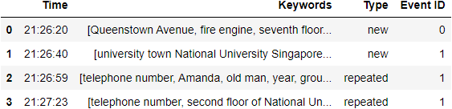

# SCDF_wat_sense

## Technologies Used
IBM Speech to Text 

IBM Natural Language Understanding

## Installation
run the following commands in the terminal

````bash
pip install ibm_watson
````

## Usage
Create IBM cloud account.

Add Speech to Text and Natural Language Understanding services to resources

Open API_keys_URL.txt and replace the words with relevant API keys and URLs

Run the following commands to create a dataframe

````bash
python createdf.py
````

Run the following commands to add an audio file to the dataframe

````bash
python main.py API_KEY_URL.txt PATH_TO_AUDIO_FILE
````

## Description
WATSENSE is a product aimed to reduce the workload of SCDF’s operation centre by identifying calls reporting on the same emergency situation, providing automated responses, eliminating the need for operators’ responses thus reducing operators’ workload.

When a call is received by the operation centre, it is automatically recorded as an audio file. WATSENSE technology will then process the audio in a series of steps.

Firstly, IBM Speech to Text model will transcribe the audio recording into text.

Secondly, IBM Natural Language Understanding model will identify a set of keywords from the text.

Thirdly, a Cosine-similarity check is executed on the set of keywords, against previous calls, identifying calls of the same emergency.

Fourthly, similar calls will be grouped as the same Event ID, intepreted as repeat calls.

Lastly, identified repeat calls will receive automated responses, eliminating the need for operators to answer the call, reducing operator workloads.

## Tests
The table below shows an the dataframe printed after running WATSENSE on the test audio provided in the Test Audio/ folder



The first entry in the table is a call regarding a fire in Queenstown.

The second, third and fourth entry in the table all relate to the same event, an unconscious man in Utown. 
Therefore only the second entry is recorded as new while the third and fourth entry is recorded as repeated and are given the same Event ID as the second entry. 
